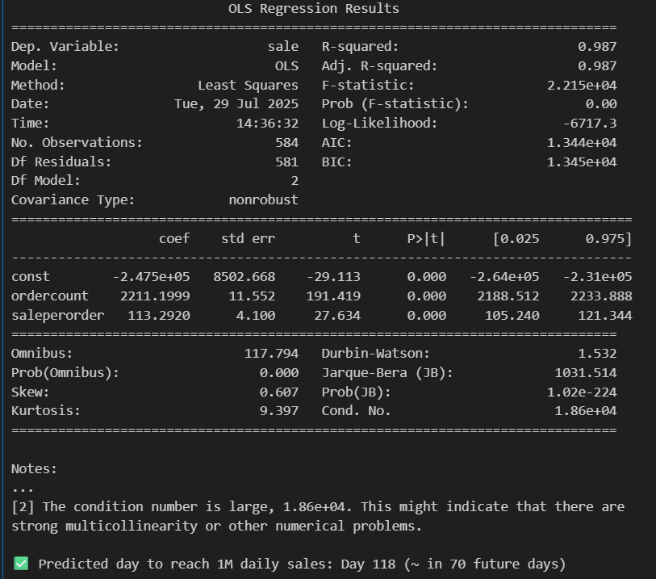
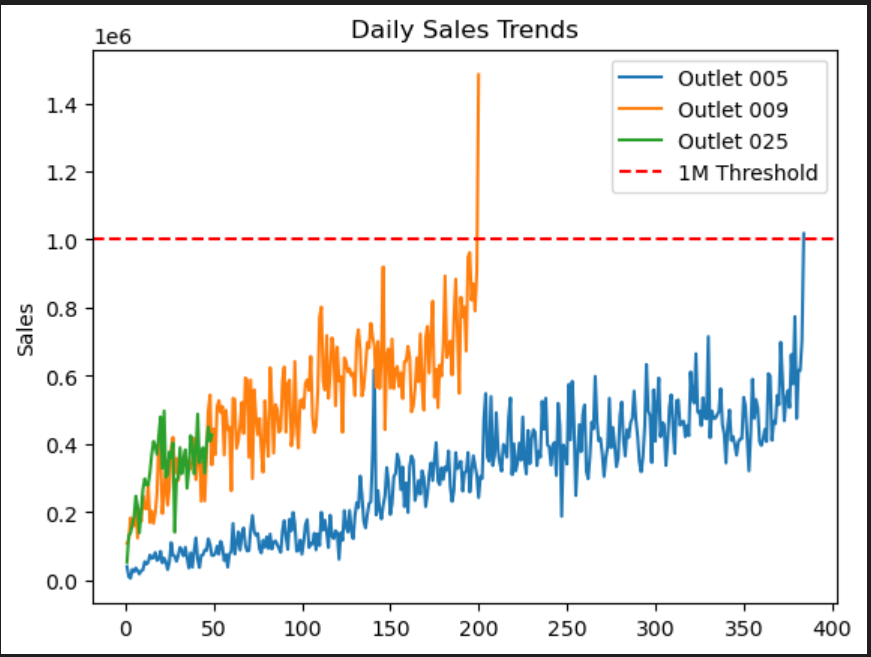

# 🛒 Sales Forecasting for Newly Opened Outlet - 2025

This project tracks and analyzes the growth of a newly launched outlet from its opening on **June 10, 2025**, to reaching a major sales milestone of **₨1,000,000 per day**.

## 📊 Objective

Using **OLS Regression**, I attempted to forecast the number of days it would take for the outlet to achieve ₨1M in daily sales. Based on early trends, the model predicted the milestone would be reached **118 days** after launch — on **October 6, 2025**.

However, reality had other plans — the store hit **₨1M/day** a **day earlier**, on **October 5, 2025**! 🔥

---

## 🔧 Methodology

- 📅 **Start Date:** June 10, 2025  
- 📈 **Model Used:** Ordinary Least Squares (OLS) Regression  
- 🧠 **Tools:** Python, Pandas, Statsmodels, Matplotlib  
- 🧮 **Data:** Daily sales figures for the outlet  
- 🎯 **Prediction:** 1M sales/day on October 6, 2025 (Day 118)  
- ✅ **Actual Outcome:** Achieved on October 5, 2025 (Day 117)

---

## 📷 Visuals

### 1. 📌 Sales Forecast vs Actual (OLS Trendline)

### 2. 📈 Day-wise Sales Comparison

### 3. 📅 118 Day Prediction Milestone

---

## 🚀 Lessons & Reflections

- Forecasting is powerful, but real-world performance can surprise you.
- Missing by one day isn't failure — it's a sign the strategy is working faster than expected.
- Regression + intuition + teamwork = results.

---

## 📌 Tags

`#forecasting` `#olsregression` `#retailanalytics` `#salesprediction` `#python` `#milestone` `#teamwork` `#chatgpt` `#githubproject`

